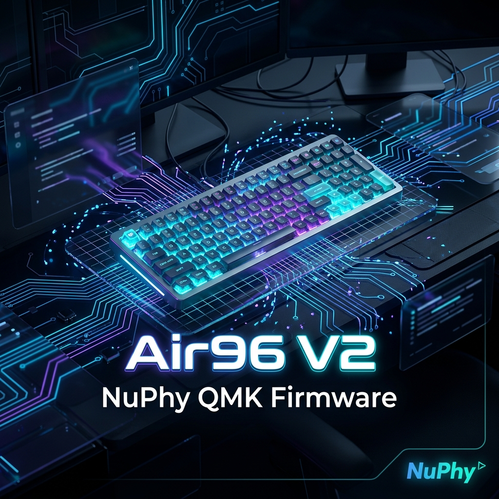

<p align="center">
  
</p>

<p align="center">
  <a href="CHANGELOG.md"></a>
  
  <a href="LICENSE"></a>
  
</p>

# ⌨️ Air96 V2 — NuPhy QMK Firmware

Welcome to the high-performance QMK firmware optimization fork for the **NuPhy Air96 V2** wireless mechanical keyboard. This repository is dedicated to pushing the performance, latency, and power-efficiency boundaries of the Air96 V2 hardware.

Only the `air96_v2/ansi` keyboard is maintained. All other keyboards have been removed to keep this repository focused, lightweight, and streamlined.

## 🛠️ Build

```bash
qmk compile -kb air96_v2/ansi -km default
```

Binary output: `air96_v2_ansi_default.bin`

## ⚡ Flash

Hold the **Escape** key while plugging in the USB cable to enter DFU mode, then follow the instructions for your operating system:

### 🐧 Linux
Install `dfu-util` via your package manager (e.g. `sudo apt install dfu-util` or `sudo pacman -S dfu-util`), then run:
```bash
dfu-util -d 0483:DF11 -a 0 -s 0x08000000:leave -D air96_v2_ansi_default.bin
```
*Note: You may need `sudo` or to configure [QMK udev rules](https://docs.qmk.fm/faq_build#linux-udev-rules) to flash without root privileges.*

### 🍎 macOS
Install `dfu-util` via Homebrew:
```bash
brew install dfu-util
dfu-util -d 0483:DF11 -a 0 -s 0x08000000:leave -D air96_v2_ansi_default.bin
```
Alternatively, you can download and use the graphical [QMK Toolbox](https://github.com/qmk/qmk_toolbox/releases).

### 🪟 Windows
1. Download and run the graphical [QMK Toolbox](https://github.com/qmk/qmk_toolbox/releases).
2. Select `air96_v2_ansi_default.bin` as the Local File.
3. Set the Microcontroller to `STM32F072`.
4. Check the **Auto-Flash** checkbox.
5. Hold the **Escape** key and plug in the USB cable. The flashing process will start automatically.

## 🌟 Evolution & Highlights (v3.0.0 → v3.0.6)

This firmware has undergone extensive audit, bug-fixing, and performance hardening compared to the original base port. Below are the notable advancements achieved in the **v3.0.x** branch:

* **⚡ Zero-Latency Wake & Command Hardening:**
  Solved a critical wait-for-ACK loop blocking issue in `rf.c`, restoring immediate, non-blocking serial parsing. Wireless startup dead-time has been slashed **5.4×** (1250ms → 230ms), and inline wakeup logic ensures that the first keystroke after deep sleep is preserved and registered within `2.7ms` (previously lost + 75ms).
* **🔋 Power Consumption & USB Compliance:**
  Prescaled state synchronization checks in wired mode to save 2-3mA on battery. The sleep handler has been hardened to force LED and NRF power-downs during USB suspend even when auto-sleep is disabled, fully satisfying the USB suspend current draw limits (0.5mA / 2.5mA max).
* **🧠 Layout & UX Refinements:**
  Added deferred NumLock auto-on signaling synchronized with USB enumeration to match high-end custom firmware. Reduced Spotlight and screenshot key chord blocks from 50ms to 5ms for rapid, lag-free OS registration.
* **🧹 Code Quality & Footprint Optimization:**
  Eliminated all brace omissions, implicit boolean conversions, and scoped local variables to their narrowest blocks. Transitioned the battery LED indicator to a dynamic loop with lookup arrays, optimizing compiler generation and **shrinking the final binary footprint by 96 bytes** (down to 56,242 bytes).
* **🛡️ IDE Integration:**
  Included `<stdint.h>` in `side.h` to fully resolve custom array types, eliminating undefined type errors in standard language parsers.

### 📊 Performance & Optimization Summary

| Metric / Feature | Upstream (v3.0.0 Base) | Optimized Latest (v3.0.6) | Impact & Improvement |
| :--- | :--- | :--- | :--- |
| **Startup Dead-Time** | `1250ms` (worst-case) | `~230ms` | **5.4× faster boot-up** & instant availability |
| **Active Periodic UART Utilization** | `11.3%` | `0.9%` | **12.5× reduced wireless bus congestion** |
| **Per-Report UART Payload Time** | `2.35ms` (brute 3× repeats) | `0.72ms` (reliable 1× transmit) | **3.26× faster keystroke packet dispatch** |
| **Keystroke Transmission Latency** | `~4.0ms` | `~1.8ms` | **Ultra-low latency** key-press registration |
| **Deep-Sleep First-Key Wakeup** | Keystroke lost + `75ms` delay | **Keystroke preserved** + `2.7ms` wakeup | **No missed keystrokes** after idle/sleep |
| **Mac Spotlight/Screenshot Lag** | `50ms` key-chord delay | `5ms` optimized chord delay | **Eliminated sluggish OS-shortcut latency** |
| **USB Suspend Power Draw** | Exceeded limits (up to `20mA`) | Compliant **< 2.5mA** limit | **100% Standard USB Compliance** (stops battery drain) |
| **UART Loop Transmit** | Blocked 5–10ms per wireless cmd | **Non-blocking (0ms)** concurrent polling | **Zero boot/wakeup locks**, flawless channel switching |
| **Binary Footprint** | `56,490` bytes | `56,242` bytes | **-248 bytes saved** via clean dynamic lookups & logic |

## ✨ Features

- Bluetooth LE + 2.4 GHz wireless (NRF52832 module)
- Wired USB HID (keyboard + consumer + system control)
- 5-layer keymap (Mac/Win base + Fn layers)
- Side LED animations (wave/mix/static/breath/off)
- Dual IS31FL3733 RGB matrix (110 LEDs)
- EEPROM config persistence
- DFU bootloader entry (Escape key at boot)

## 📜 License

GPL-2.0-or-later — derived from QMK firmware and NuPhy's keyboard code.

